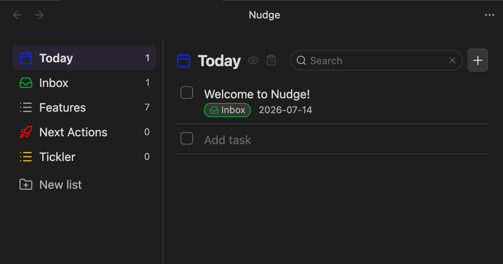

# Nudge



A task manager for Obsidian, backed by a single
[`todo.txt`](http://todotxt.org/) file. Desktop-only (macOS). Passive by
design — items just surface in **Today** when their due date arrives; there are
no OS notifications.

See [SPEC.md](./SPEC.md) for the full design.

## Features

- Custom view with a **Today** filter plus one list per `+project` tag.
- A configurable **Default list** (default `Inbox`), always pinned under Today.
- Structured create/edit modal — no hand-typed todo.txt syntax. Fields: text,
  list, due date, priority, link, and a recurrence picker (stored as `rec:<RRULE>`).
- Completing a recurring item spawns its next occurrence, anchored on the
  original due date.
- Drag and drop to reorder, move between lists, or drop into Today.
- **Fuzzy search** across all lists (the magnifying glass in the header, or a
  configurable hotkey — e.g. Cmd+F — set in the plugin settings): live results
  as you type, matching item text and link URLs, with matched characters
  highlighted. Esc returns to the previous view.
- Every change is a read-modify-write against the file, so external edits
  (e.g. an agent rewriting `todo.txt`) show up automatically.
- Optional macOS **Dock badge** (off by default) counting overdue tasks —
  optionally including tasks due today, which matches the Today view count.

## Install (unpacked dev plugin)

1. Build the plugin:
   ```bash
   npm install
   npm run build      # or: npm run dev  (watch mode)
   ```
2. Copy/symlink the plugin folder into your vault's plugins directory so it
   contains `manifest.json`, `main.js`, and `styles.css`:
   ```bash
   ln -s "$(pwd)" "<YourVault>/.obsidian/plugins/nudge"
   ```
3. In Obsidian: **Settings → Community plugins**, disable Restricted mode, then
   enable **Nudge**.

## Adding items

- The **+** button in the panel header (on every view, including Today).
- The **New task** ribbon icon or command.
- A configurable global **hotkey** (default `Cmd+N`), set in the plugin
  settings. It uses a capture-phase listener so it can override Obsidian's own
  binding for that combo.
- Single-click a row to complete/uncomplete it; use the pencil button to edit.

## Creating items via Obsidian URI

The plugin registers a protocol handler so external tools, shortcuts, or links
can create tasks:

```
obsidian://nudge?text=Buy%20milk&list=Groceries&due=2026-07-20&priority=high&link=https%3A%2F%2Fexample.com
```

| Arg        | Maps to        | Notes |
|------------|----------------|-------|
| `text`     | description    | If present, the item is created directly. If omitted, the prefilled modal opens instead. |
| `list`     | `+Project`     | Whitespace is stripped. Defaults to the configured **Default list**. |
| `due`      | `due:`         | `YYYY-MM-DD`. |
| `priority` | `(A)`/`(B)`/`(C)` | Accepts `high`/`med`/`low` or `A`/`B`/`C` (case-insensitive). |
| `link`     | `link:`        | URL. |
| `rec`      | `rec:`         | A raw [RRULE](https://icalendar.org/rrule-tool.html), e.g. `FREQ=WEEKLY;BYDAY=MO`. |
| `modal`    | —              | `modal=1` opens the prefilled create modal instead of creating directly. |

**Modes:**

- **Direct create** — when `text` is provided (and `modal` is not set): the item
  is appended (with today's creation date), a notice is shown, and open views
  refresh.
- **Prefilled modal** — when `text` is omitted or `modal=1`: the create modal
  opens with the given fields filled in for review.

**Encoding notes:** URL-encode all values — especially the `rec` RRULE's `;`
and `=`, and `:`/`/` in links. With multiple vaults, add `&vault=<name>` to
route to the right one.
